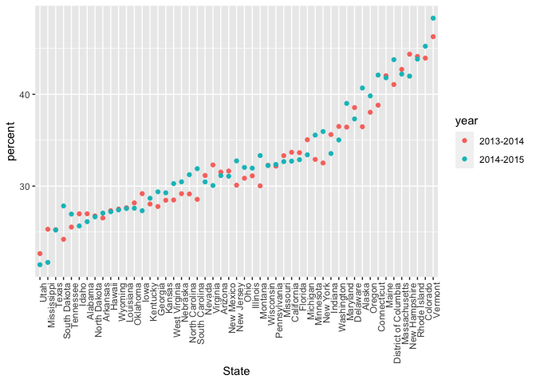
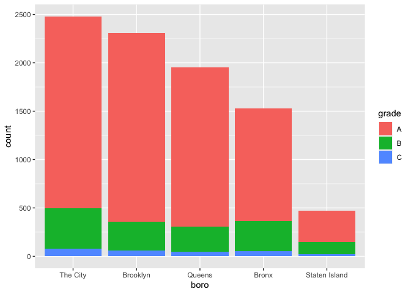

Strings and factors
================
Diana Hernandez
2023-10-17

``` r
library(tidyverse)
```

    ## ── Attaching core tidyverse packages ──────────────────────── tidyverse 2.0.0 ──
    ## ✔ dplyr     1.1.3     ✔ readr     2.1.4
    ## ✔ forcats   1.0.0     ✔ stringr   1.5.0
    ## ✔ ggplot2   3.4.3     ✔ tibble    3.2.1
    ## ✔ lubridate 1.9.2     ✔ tidyr     1.3.0
    ## ✔ purrr     1.0.2     
    ## ── Conflicts ────────────────────────────────────────── tidyverse_conflicts() ──
    ## ✖ dplyr::filter() masks stats::filter()
    ## ✖ dplyr::lag()    masks stats::lag()
    ## ℹ Use the conflicted package (<http://conflicted.r-lib.org/>) to force all conflicts to become errors

``` r
library(rvest)
```

    ## 
    ## Attaching package: 'rvest'
    ## 
    ## The following object is masked from 'package:readr':
    ## 
    ##     guess_encoding

``` r
library(p8105.datasets)
```

# Strings and manipulations

`str_detect` finds the pattern within the string. Has to be exact match.

`str_replace` can replace one string for another string.

``` r
string_vec = c("my", "name", "is", "jeff")

str_detect(string_vec, "jeff")
```

    ## [1] FALSE FALSE FALSE  TRUE

``` r
str_detect(string_vec, "Jeff")
```

    ## [1] FALSE FALSE FALSE FALSE

``` r
str_replace(string_vec, "jeff", "Jeff")
```

    ## [1] "my"   "name" "is"   "Jeff"

start with: ^ ends with: \$

``` r
string_vec = c(
  "i think we all rule for participating",
  "i think i have been caught",
  "i think this will be quite fun actually",
  "it will be fun, i think"
  )

str_detect(string_vec, "i think")
```

    ## [1] TRUE TRUE TRUE TRUE

``` r
str_detect(string_vec, "^i think")
```

    ## [1]  TRUE  TRUE  TRUE FALSE

``` r
str_detect(string_vec, "i think$")
```

    ## [1] FALSE FALSE FALSE  TRUE

If you want both lower and uppercase: \[Pp\]

``` r
string_vec = c(
  "Time for a Pumpkin Spice Latte!",
  "went to the #pumpkinpatch last weekend",
  "Pumpkin Pie is obviously the best pie",
  "SMASHING PUMPKINS -- LIVE IN CONCERT!!"
  )

str_detect(string_vec,"pumpkin")
```

    ## [1] FALSE  TRUE FALSE FALSE

``` r
str_detect(string_vec,"Pumpkin")
```

    ## [1]  TRUE FALSE  TRUE FALSE

``` r
str_detect(string_vec,"[Pp]umpkin")
```

    ## [1]  TRUE  TRUE  TRUE FALSE

Can detect multiple strings

``` r
string_vec = c(
  '7th inning stretch',
  '1st half soon to begin. Texas won the toss.',
  'she is 5 feet 4 inches tall',
  '3AM - cant sleep :('
  )

str_detect(string_vec, "[0-9]")
```

    ## [1] TRUE TRUE TRUE TRUE

``` r
str_detect(string_vec, "^[0-9]")
```

    ## [1]  TRUE  TRUE FALSE  TRUE

``` r
str_detect(string_vec, "^[0-9][a-z]")
```

    ## [1]  TRUE  TRUE FALSE FALSE

``` r
str_detect(string_vec, "^[0-9][a-zA-Z]")
```

    ## [1]  TRUE  TRUE FALSE  TRUE

The character `.` matches anything.

``` r
string_vec = c(
  'Its 7:11 in the evening',
  'want to go to 7-11?',
  'my flight is AA711',
  'NetBios: scanning ip 203.167.114.66'
  )

str_detect(string_vec, "7.11")
```

    ## [1]  TRUE  TRUE FALSE  TRUE

Some characters are “special”. These include `[` and `]`, `(` and `)`,
and .. If you want to search for these, you have to indicate they’re
special using `\`. Unfortunately, `\` is also special, so things get
weird. Two `\\` to find a special character that is not `\`.

``` r
string_vec = c(
  'The CI is [2, 5]',
  ':-]',
  ':-[',
  'I found the answer on pages [6-7]'
  )

str_detect(string_vec, "\\[")
```

    ## [1]  TRUE FALSE  TRUE  TRUE

# Factors

`fct_relevel` to relevel a factor. Changes the order.

``` r
vec_sex = factor(c("male", "male", "female", "female"))

vec_sex
```

    ## [1] male   male   female female
    ## Levels: female male

``` r
as.numeric(vec_sex)
```

    ## [1] 2 2 1 1

``` r
vec_sex = fct_relevel(vec_sex, "male")

vec_sex
```

    ## [1] male   male   female female
    ## Levels: male female

``` r
as.numeric(vec_sex)
```

    ## [1] 1 1 2 2

# NSDUH

``` r
nsduh_url = "http://samhda.s3-us-gov-west-1.amazonaws.com/s3fs-public/field-uploads/2k15StateFiles/NSDUHsaeShortTermCHG2015.htm"

table_marj = 
  read_html(nsduh_url) |> 
  html_table() |> 
  first() |>
  slice(-1)
```

need to tidy this dataset!

``` r
marj_df =
  table_marj |> 
  select(-contains("P Value")) |> 
  pivot_longer(
    !State,
    names_to = "age_year",
    values_to = "percent"
  ) |> 
  separate(age_year, into = c("age", "year"), "\\(") |> 
  mutate(year = str_replace(year, "\\)", ""),
         percent = str_replace(percent, "[a-b]", ""),
         percent = as.numeric(percent)
  ) |>
  filter(!(State %in% c("Total U.S.", "Northeast", "Midwest", "South", "West")))
```

``` r
marj_df |>
  filter( age == "18-25") |>
  mutate(State = fct_reorder(State, percent)) |>
  ggplot(aes(x = State, y = percent, color = year)) +
  geom_point() +
  theme(axis.text.x = element_text(angle = 90, hjust = 1))
```

<!-- -->

# NYC Restaurant Inspections

``` r
data("rest_inspec")

rest_inspec
```

    ## # A tibble: 397,584 × 18
    ##    action          boro  building  camis critical_flag cuisine_description dba  
    ##    <chr>           <chr> <chr>     <int> <chr>         <chr>               <chr>
    ##  1 Violations wer… MANH… 425      4.15e7 Not Critical  Italian             SPIN…
    ##  2 Violations wer… MANH… 37       4.12e7 Critical      Korean              SHIL…
    ##  3 Violations wer… MANH… 15       4.11e7 Not Critical  Café/Coffee/Tea    CITY…
    ##  4 Violations wer… MANH… 35       4.13e7 Critical      Korean              MADA…
    ##  5 Violations wer… MANH… 1271     5.00e7 Critical      American            THE …
    ##  6 Violations wer… MANH… 155      5.00e7 Not Critical  Donuts              DUNK…
    ##  7 Violations wer… MANH… 1164     5.00e7 Critical      Salads              SWEE…
    ##  8 Violations wer… MANH… 37       4.12e7 Not Critical  Korean              SHIL…
    ##  9 Violations wer… MANH… 299      5.01e7 Not Critical  American            PRET…
    ## 10 Violations wer… MANH… 53       4.04e7 Not Critical  Korean              HAN …
    ## # ℹ 397,574 more rows
    ## # ℹ 11 more variables: inspection_date <dttm>, inspection_type <chr>,
    ## #   phone <chr>, record_date <dttm>, score <int>, street <chr>,
    ## #   violation_code <chr>, violation_description <chr>, zipcode <int>,
    ## #   grade <chr>, grade_date <dttm>

``` r
rest_inspec |>
  count(boro, grade) |>
  pivot_wider(
    names_from = grade, 
    values_from = n
  ) |>
  knitr::kable()
```

| boro          |     A |     B |    C | Not Yet Graded |   P |    Z |    NA |
|:--------------|------:|------:|-----:|---------------:|----:|-----:|------:|
| BRONX         | 13688 |  2801 |  701 |            200 | 163 |  351 | 16833 |
| BROOKLYN      | 37449 |  6651 | 1684 |            702 | 416 |  977 | 51930 |
| MANHATTAN     | 61608 | 10532 | 2689 |            765 | 508 | 1237 | 80615 |
| Missing       |     4 |    NA |   NA |             NA |  NA |   NA |    13 |
| QUEENS        | 35952 |  6492 | 1593 |            604 | 331 |  913 | 45816 |
| STATEN ISLAND |  5215 |   933 |  207 |             85 |  47 |  149 |  6730 |

``` r
inspection_df =
  rest_inspec |>
  filter( grade %in% c("A", "B", "C"), boro != "Missing") |>
  mutate(boro = str_to_title(boro),
         dba = str_to_upper(dba)
  )
```

Pizza!

``` r
inspection_df |>
  filter(str_detect(dba, "PIZZA")) |>
  count(boro)
```

    ## # A tibble: 5 × 2
    ##   boro              n
    ##   <chr>         <int>
    ## 1 Bronx          1531
    ## 2 Brooklyn       2305
    ## 3 Manhattan      2479
    ## 4 Queens         1954
    ## 5 Staten Island   471

Assumes alphabetical order

``` r
inspection_df |>
  filter(str_detect(dba, "PIZZA")) |>
  mutate(boro = fct_infreq(boro)) |>
  ggplot(aes(x = boro, fill = grade)) +
  geom_bar()
```

<!-- -->

``` r
inspection_df |>
  filter(str_detect(dba, "PIZZA")) |>
  mutate(boro = fct_infreq(boro),
         boro = recode(boro, "Manhattan" = "The City")
         ) |>
  ggplot(aes(x = boro, fill = grade)) +
  geom_bar()
```

<!-- -->
